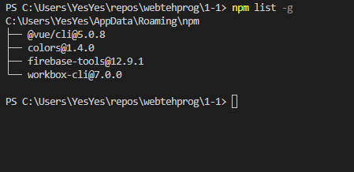
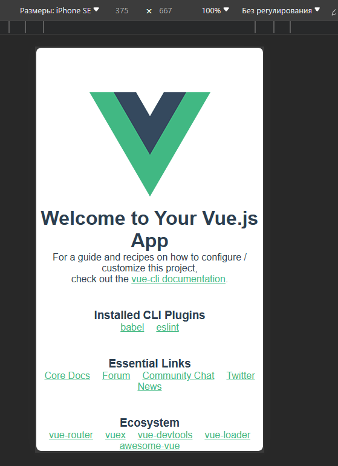
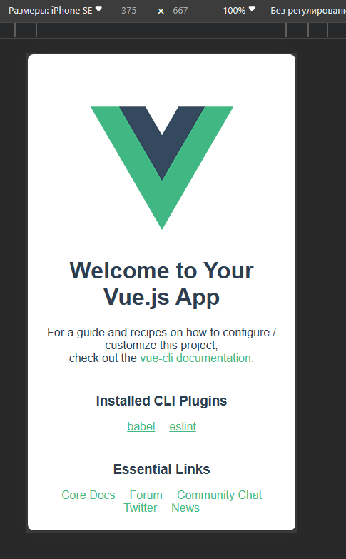
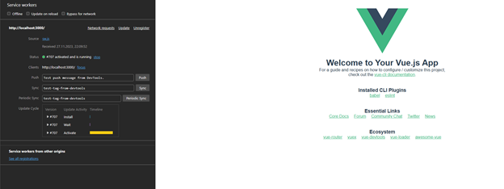

# Web-технологии. Лабараторная работа №1.

Работа выполнена студентом группы ИТб-5301 Митиковым В.О.

## Содержание
- [Web-технологии. Лабараторная работа №1.](#web-технологии-лабараторная-работа-1)
	- [Содержание](#содержание)
	- [Задание](#задание)
	- [Ход работы](#ход-работы)
		- [Настройка окружения](#настройка-окружения)
		- [Разработка PWA приложения](#разработка-pwa-приложения)
	- [Вывод](#вывод)

## Задание
- Необходимо организовать рабочее окружение;
- Разработать простейшее PWA приложение и изучить его работу.

## Ход работы
### Настройка окружения
Для организации рабочего окружения необходимо:
- Установить Node.js
- Установить Vue.js
- Установить Workbox
- Установить Firebase
- Установить git

Для установки Node.js необходимо воспользоваться командой:  
`choco install nodejs`  
Для установки Vue.js необходимо воспользоваться командой:  
`npm install -g @vue/cli`  
Для установки Workbox необходимо воспользоваться командой:  
`npm install workbox-cli --global`  
Для установки Firebase необходимо воспользоваться командой:  
`npm install -g firebase-tools`  
Для установки git необходимо воспользоваться командой:  
`choco install -y git`  

Результат установки программ указан на изображении ниже.


### Разработка PWA приложения
Для начала разработки PWA приложения необходимо создать новый проект vue с помощью команды `vue create app`  
Протестировать работу приложения можно с помощью команд `npm run serve`. Результат запуска приложения представлен ниже.  
  

Затем необходимо установить поодержку декоратора Material Design, для этого необходимо добавить компонент во vue:
`npm isntall vuetify --save` и подключить модуль в main.js. Результат представлен ниже.  
  

Далее необходимо сгенерировать манифест приложения с помощью сервиса [генератор manifest.json](https://app-manifest.firebaseapp.com/ ) и указать файл manifest.json в index.html.

Для генерации Service Worker необходимо использовать следующуюю команду `workbox wizard`, подключить скрипт к index.html  и выполнить `npm run build; workbox generate:sw workbox-config.js`.  
Запустить готовое приложении и проверки его работы необходимо выполнить 
```
npm run build
workbox generate:sw workbox-config.js
serve -s dist
```
Результат работы приложения представлен ниже.
  
## Вывод
В ходе работы было организовано рабочее окружение и разработано простейшее PWA приложение и изучена его работа.