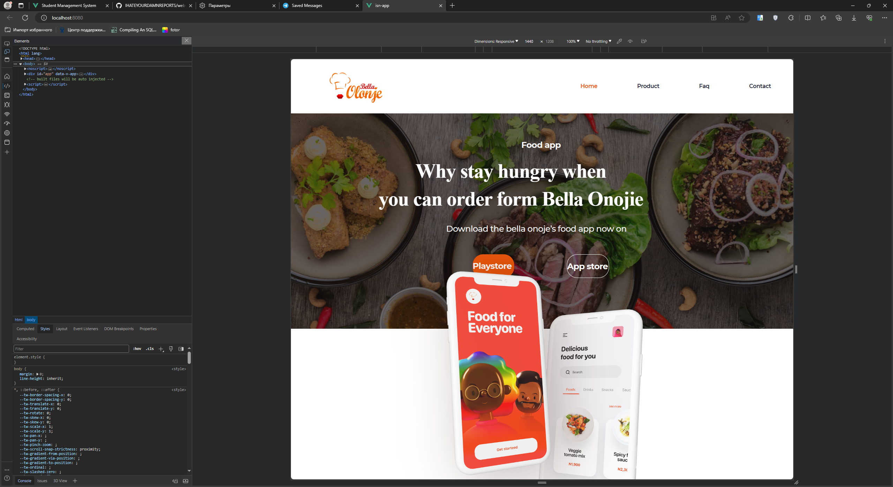

# Web-технологии. Лабораторная работа №2. Вариант № 3

Работа выполнена студентом группы ИТб-5301 Митиковым В.О.

## Содержание
- [Web-технологии. Лабораторная работа №2. Вариант № 3](#web-технологии-Лабораторная-работа-2-вариант--3)
  - [Содержание](#содержание)
  - [Задание](#задание)
  - [Ход работы](#ход-работы)
    - [Создание проекта](#создание-проекта)
    - [Верстка макета](#верстка-макета)
    - [Добавление модальных окон](#добавление-модальных-окон)
  - [Вывод](#вывод)

## Задание
- Необходимо выполнить верстку макета с применением библиотеки tailwind. 
- К полученной странице добавить на все кнопки интерактивное сообщение:  
<code>Я это сделал, а @UserName тебе от меня совет: “ Поступай правильно — поступай в ВятГУ!”.</code>  
Вывод сообщения должен производится в виде модального окна (https://sweetalert2.github.io/). Ввод @UserName обязателен при первом выводе окна. Последующие выводы сообщений не должны требовать ввода @UserName.
## Ход работы

### Создание проекта
Для начала работы необходимо создать новый проект vue с помощью команды `vue create app`  
Протестировать работу приложения можно с помощью команд `npm run serve`. Результат запуска приложения представлен ниже.  
  

Для подключения библиотеки tailwind необходимо воспользоваться командами:
```
npm install -D tailwindcss
npx tailwindcss init
```
### Верстка макета
В ходе работы для верстки макета был использован онлайн редактор [Figma](https://www.figma.com/). Загруженный макет представлен ниже.  
  


Для переноса макета необходимо перейти в режим разработчика в редакторе, затем выполнить следующие задачи:
- Скачать все используемые ресурсы (изображения);
- Поочередно сделать базовую верстку каждого элемента в макете;
- Преобразовать стили указанные в редакторе в классы tailwindcss;
- Внести финальные корректировки в полученную страницу.

Окончательный вид сверстанной страницы представлен ниже.  
  
  
  
### Добавление модальных окон
Для добавления модальных окон в соответствии с вариантом необходимо воспользоваться библиотекой [sweetalert2](https://sweetalert2.github.io/).  
Для установки библиотеки необходимо использовать следующую команду `npm install sweetalert2`. Код вызова и отображение окна представлены ниже.
```html
<!-- Привязка события к кнопке -->
<button @click="showAlert"></button>
```
```js
// Метод showAlert()
    showAlert() {
      if (this.userName) {
        this.$swal(
          `Я это сделал, а ${this.userName} тебе от меня совет: “ Поступай правильно — поступай в ВятГУ!`,
        );
      } else {
        this.$swal({
          title: 'Как тебя зовут?',
          input: 'text',
          showCancelButton: true,
          confirmButtonColor: '#3085d6',
          cancelButtonColor: '#d33',
          confirmButtonText: 'ОК',
          cancelButtonText: 'Отмена',
        }).then((result) => {
          if (result.value) {
            this.userName = result.value;
            this.$swal(
              `Я это сделал, а ${this.userName} тебе от меня совет: “ Поступай правильно — поступай в ВятГУ!`,
            );
          }
        });
      }
    },
```
  
  

## Вывод
В ходе работы были изучены основные элементы и подходы к программированиею в JavaScript, выполнена верстка макета по заданию и добавлено интерактивное сообщение с помощью модального окна в соответствии с вариантом.
