# Web-технологии. Лабараторная работа №3. Вариант № 3

Работа выполнена студентом группы ИТб-5301 Митиковым В.О.

## Содержание
- [Web-технологии. Лабараторная работа №3. Вариант № 3](#web-технологии-лабараторная-работа-3-вариант--3)
  - [Содержание](#содержание)
  - [Задание](#задание)
  - [Ход работы](#ход-работы)
    - [Создание проекта](#создание-проекта)
    - [Верстка макета](#верстка-макета)
    - [Адаптирование веб-страницы](#адаптирование-веб-страницы)
    - [Добавление обработчиков событий](#добавление-обработчиков-событий)
  - [Вывод](#вывод)

## Задание
- Необходимо выполнить верстку макета. 
- Макет должен содержать следующие обработчики событий:  
	- Перед отображением страницы на 543 миллисекунды должно отображаться сообщение по центру экрана “Загрузка страницы … “; 
	- Все кнопки должны иметь модальные окна, стилизованные под общую тему оформления с сообщением “Макет был реализован {Ф.И.О. разработчика}. Вариант № {номер варианта}”.
- Адаптировать сверстанный макет для корректного отображения страницы в:
	- браузер с полноэкранным разрешением 1920х1080;
	- Apple iphone 12;
	- Google pixel 5;
	- Apple ipad mini.

## Ход работы

### Создание проекта
Для начала работы необходимо создать новый проект vue с помощью команды `vue create app`  
Протестировать работу приложения можно с помощью команд `npm run serve`. Результат запуска приложения представлен ниже.  
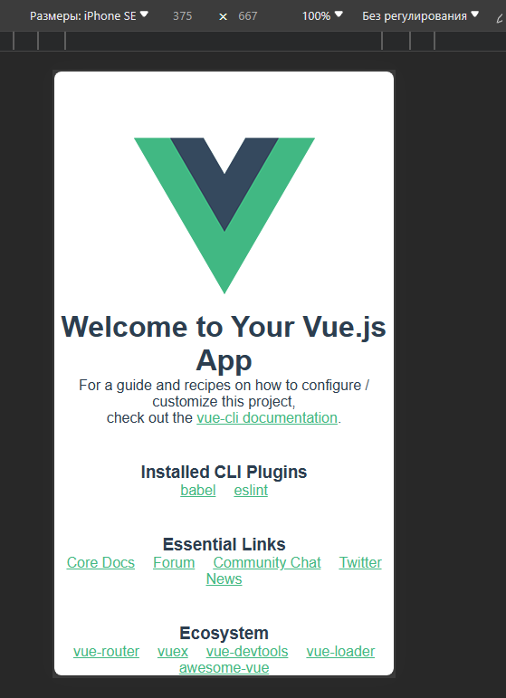  

Для подключения библиотеки tailwind необходимо воспользоваться командами:
```
npm install -D tailwindcss
npx tailwindcss init
```
### Верстка макета
В ходе работы для верстки макета был использован онлайн редактор [Figma](https://www.figma.com/). Загруженный макет представлен ниже.  
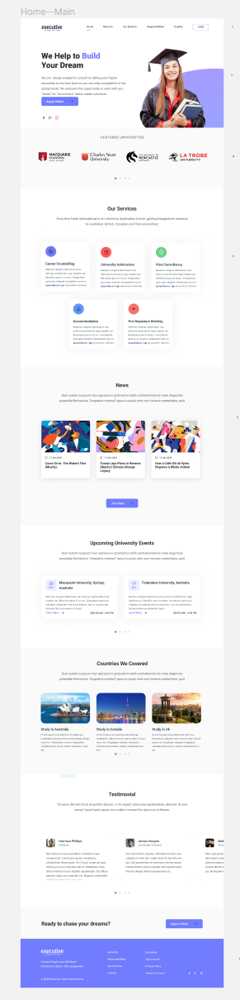  


Для переноса макета необходимо перейти в режим разработчика в редакторе, затем выполнить следующие задачи:
- Скачать все используемые ресурсы (изображения);
- Поочередно сделать базовую верстку каждого элемента в макете;
- Преобразовать стили указанные в редакторе в классы tailwindcss;
- Внести финальные корректировки в полученную страницу.  

Во время верстки логично разделить каждую секцию страницу на отдельные элементы и и затем указать их на странице следующим образом:
```html
<template>
  <w3Header></w3Header>
  <w3Face></w3Face>
  <w3Uni class="bg-[#FAFAFA] "></w3Uni>
  <div class="laptopL:h-[120px] h-[60px] bg-white"></div>
  <w3Services class=""></w3Services>
  <div class="laptopL:h-[120px] h-[60px] bg-white "></div>
  <w3News class=""></w3News>
  <w3Events class=""></w3Events>
  <div class="laptopL:h-[120px] h-[60px] bg-white"></div>
  <w3Countries class=""></w3Countries>
  <w3Testimonial class=""></w3Testimonial>
  <w3Lead class=""></w3Lead>
  <w3Footer class=""></w3Footer>
</template>
```
Также удобно выделить повторяющиеся элементы на странице, например карусель с карточками.  
Сверстанная странице ниже.
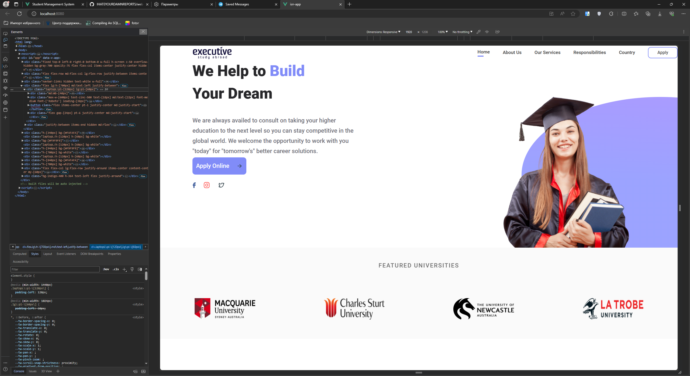  
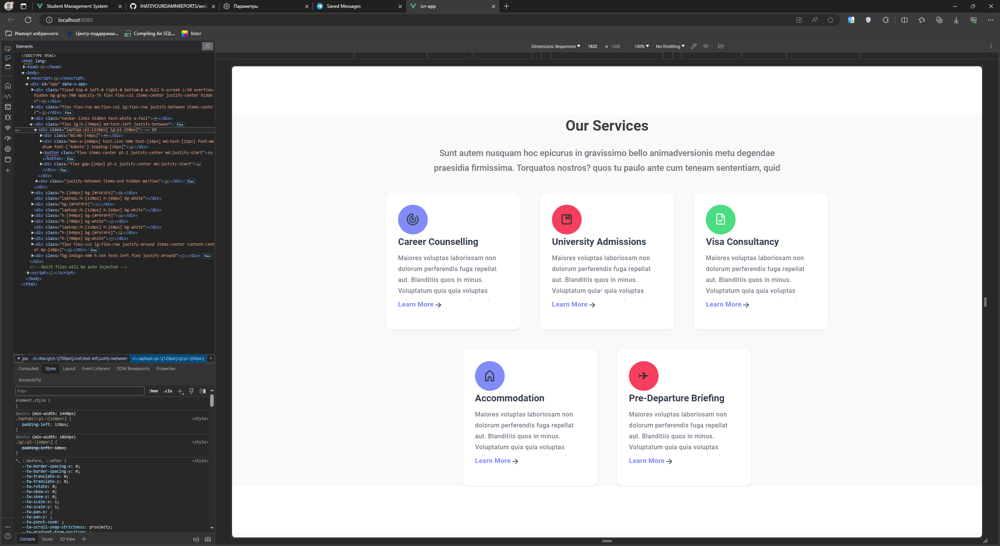  
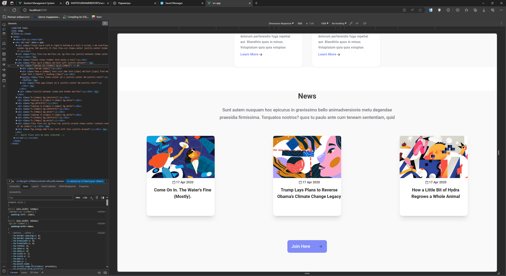  
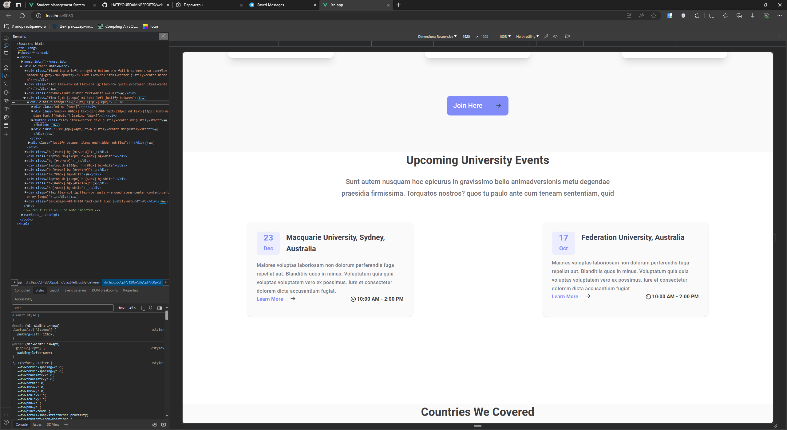  
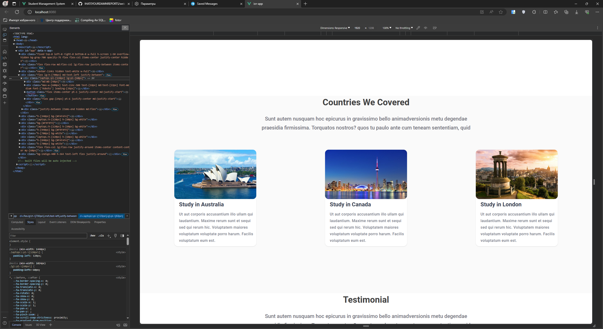  
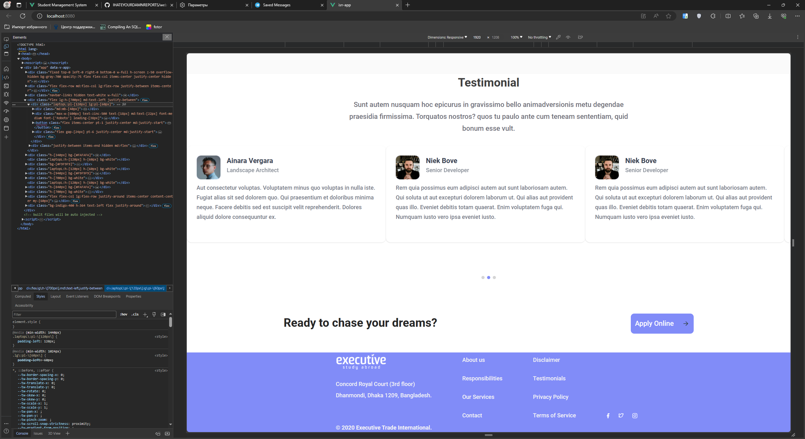  
### Адаптирование веб-страницы
Для корректного отображения сверстанной веб-страницы необходимо его адаптировать, для этого необходимо решить следующие задачи:
- С помощью директив @media (sm, sd, md, lg в tailwindcss) изменить стили элементов:
	- Размеры элементов;
	- Расположение элементов;
	- Видимость элементов (при необходимости)
- Провести дополнительную верстку и/или программирование с помощью javascript.
Учитывая, что верстка проводилась при помощи библиотеки tailwindcss, важно помнить, что tailwindcss руководствуется принципом mobile-first. Таким образом, использование директивы, например, lg: повлияет только на устройства с шириной от 1440px, тогда как аналагичный класс без директивы повлияет на устройства с шириной до 1440px.  
Некоторые адаптированные участки страницы в отображении для планшетов и смартфонов.
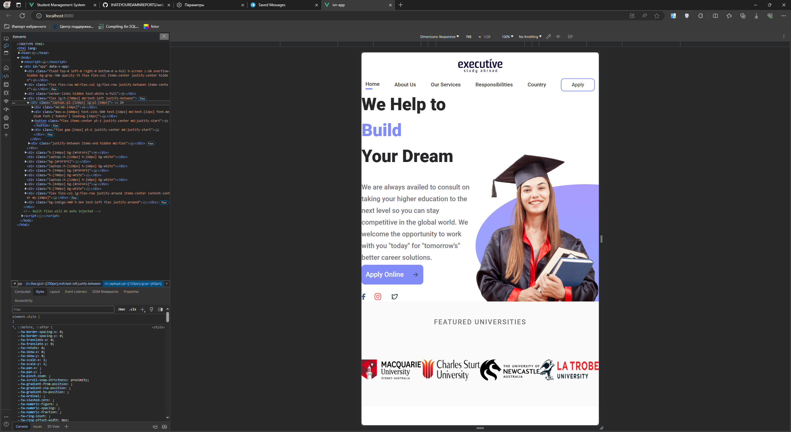  
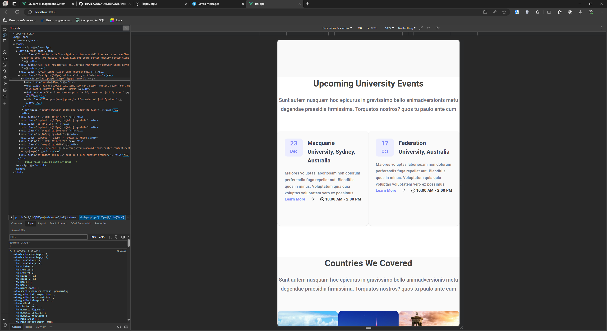  
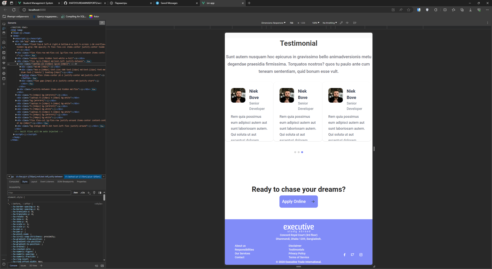  
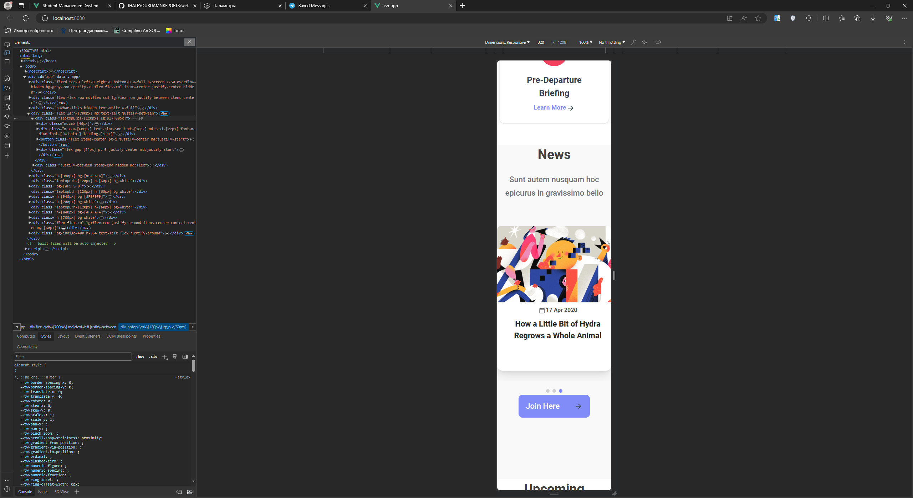  

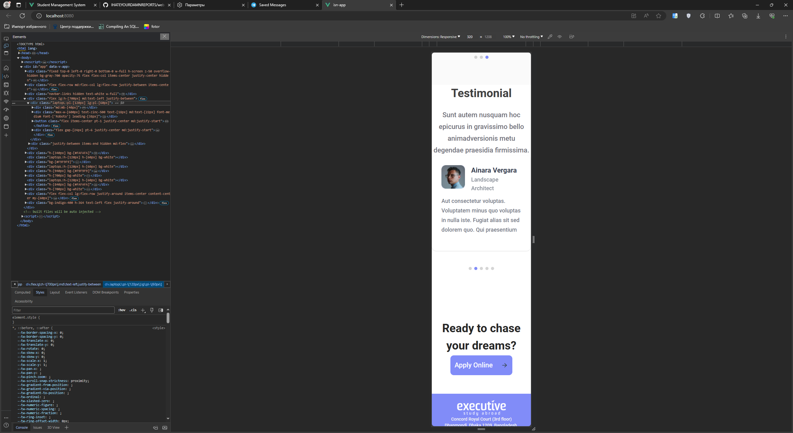  
После адаптирования страницы, необходимо провести дополнительную верстку следующих элементов:
- Навигационное меню;
- Используемые на страницы карусели;

Было принято решение схлопнуть навигационное меню до одной кнопки с выпадющим списком для отображения на мобильных устройствах. Код и отображение навигационного меню представлены ниже.
```html
<template>
    <div class="flex flex-row md:flex-col lg:flex-row justify-between
     items-center"> <!-- TODO: mb-[200px] -->
        <div class="flex flex-col lg:gap-[26px] py-4 lg:py-0 items-start
        md:items-center lg:items-start w-full lg:w-[146px] lg:ml-[60px]
        lg:h-[52px] flex-shrink-0 laptopL:ml-[120px]">
            
        </div>
        <button href="#" @click="Toggle" class="flex md:hidden flex-col
        justify-between w-10 h-8">
          <span class="sr-only">Menu</span>
          <span class="bg-slate-700 h-1 w-full"></span>
          <span class="bg-slate-700 h-1 w-full"></span>
          <span class="bg-slate-700 h-1 w-full"></span>
        </button>
    <div class="navbar-links hidden text-white w-full" v-bind:class="{ active:
    isActive}">
          <ul class="bg-indigo-400 w-full">
            <li class="hover:bg-indigo-300"><a href="#">Home</a></li>
            <li class="hover:bg-indigo-300"><a href="#">Our Services</a></li>
            <li class="hover:bg-indigo-300"><a
            href="#">Responsibilities</a></li>
            <li class="hover:bg-indigo-300"><a href="#">Country</a></li>
            <li class="hover:bg-indigo-300"><a href="#">Apply</a></li>
          </ul>
        </div>
</template>
```
```javascript
Toggle() {
      this.isActive = !this.isActive;
    }
```
```css
.navbar-links.active{
    display:flex !important;
}
```
  
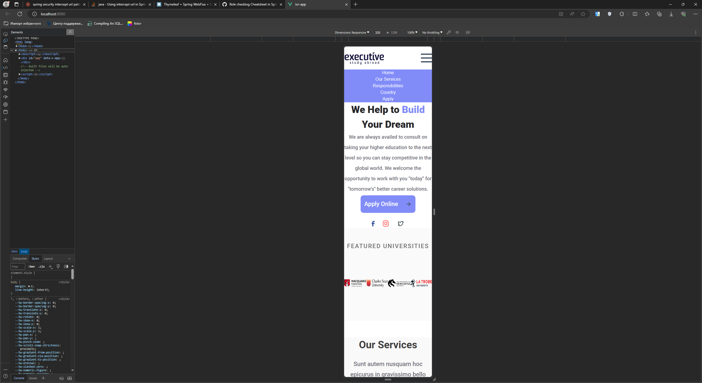  
Было принято решение анимировать сверстанные ранее карусели, и для адаптированиях их установить количество единовременно отображаемых карточек в карусели для раличных устройств.
Код копонента – [caCar.vue](https://github.com/IHATEYOURDAMNREPORTS/web-tehnologii/blob/WORK_3/src/components/WORK_3/caCar.vue). Отображение каруселей представлены ниже.
  
  
### Добавление обработчиков событий
Для добавления сообщения перед загрузкой страницы воспользуемся представленным в задании компонентом [Overlay-Loading-Screen](https://tailwindcomponents.com/component/full-page-overlay-loading-screen).  
Код для выполнения и отображение сообщения представлены ниже.
```javascript
  mounted() {
    setTimeout(() => {
      this.$refs.loader.classList.add('hidden');
    }, 543);
  },
```
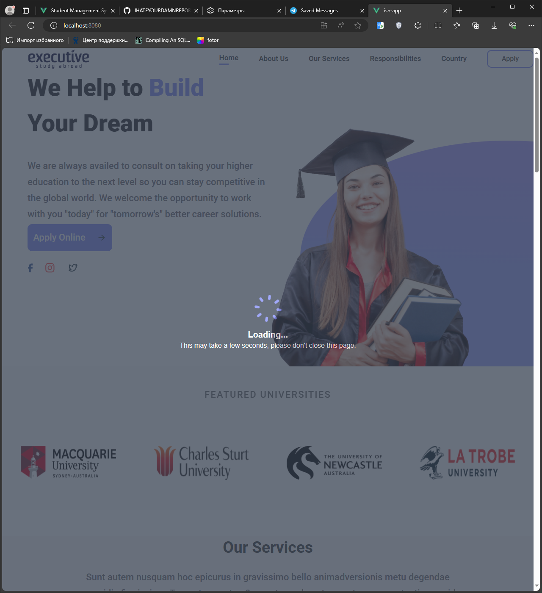  

## Вывод
В ходе работы были изучены основные элементы и пожходы к программированиею в JavaScript, выполнена верстка макета по заданию и добавлены обработчики событий в соответствии с вариантом.